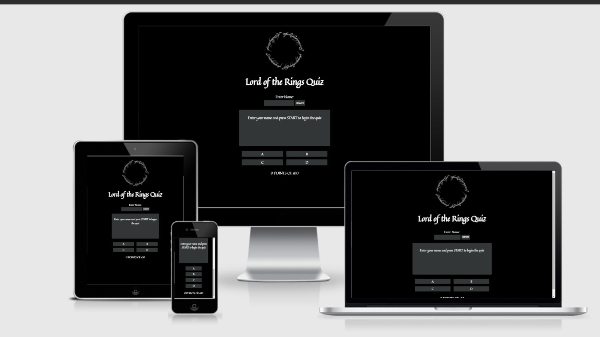
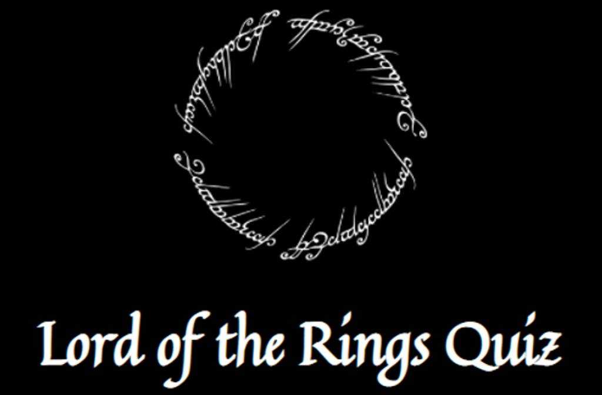
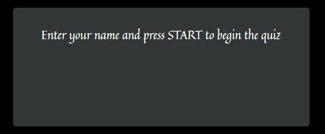
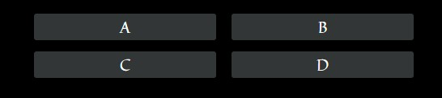
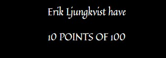
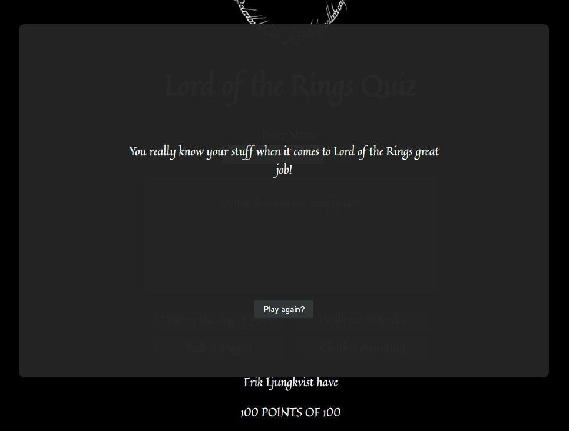

# Lord of the Rings Quiz Game

This website is for people that want to test their knowledge of Lord of the Rings. This site allows users to take a quiz on how much they know about the world of Middle earth and getts scored on how much they know.

## Features 

### Existing Features

- __The Lord of the Rings Quiz Game Logo and Heading__

  - Featured at the top of the page is the Lord of the rings logo and below is the website name, this makes it clear what the site is all about.

- __Enter name area/start area__

  - This section allows the user to enter a name to make the game more personal and the name is displayed in the point area.

  - the start button allows the user to start the game so the questions are displayed.

- __The Question section__

  - The question area is where the questions and image are displayed so the user can read them.

- __The Answer area__

  -  This section is where the answer options are displayed so the user can select what they think is the correct answer.
  - when the user selects an option an alert is displayed that indicates if the answer was correct or incorrect.

- __The Point area__

  - The point area allows the user to see how many points they have and what the maximum points are for the whole game.
  - It also displays the user's name.

- __The End area__

  - This section is a popup section that indicates to the user that the game is over and displays different messages depending on how many points the user has.
  - This section also lets the user play again if they want to.

For some/all of your features, you may choose to reference the specific project files that implement them.

In addition, you may also use this section to discuss plans for additional features to be implemented in the future:.

### Features Left to Implement

- Another feature idea

## Testing 

### Validator Testing 

- HTML
    - No errors were returned when passing through the official [W3C validator](https://validator.w3.org/nu/?doc=https%3A%2F%2Fljunkan22.github.io%2Flord-of-the-rings-quiz-game%2F)
- CSS
    - No errors were found when passing through the official [(Jigsaw) validator](https://jigsaw.w3.org/css-validator/validator?uri=https%3A%2F%2Fljunkan22.github.io%2Flord-of-the-rings-quiz-game%2F&profile=css3svg&usermedium=all&warning=1&vextwarning=&lang=sv)
- JavaScript
    - No errors were found when passing through the official [Jshint validator](https://jshint.com/)
      - There are 9 functions in this file
      - Function with the largest signature take 2 arguments, while the median is 0.
      - Largest function has 26 statements in it, while the median is 2.
      - The most complex function has a cyclomatic complexity value of 4 while the median is 1.

### Unfixed Bugs

 - No unfixed bugs

## Deployment

- The site was deployed to GitHub pages. The steps to deploy are as follows: 
  - Go to the websites repository on GitHub
  - In the GitHub repository navigate to the settings tab
  - In the options, menu go to pages
  - From the source section drop-down menu, select the main then click save
  - (if the page doesn't refresh automatically) Refresh the page and a message will come up with a link to the website

The live link can be found here - https://ljunkan22.github.io/lord-of-the-rings-quiz-game/

## Credits 

## Code

- Took some inspiration and code from this guide https://www.geeksforgeeks.org/how-to-create-a-simple-javascript-quiz/

- The answer-area event listener code on line 300 was written by a mentor called Sean, he helped me understand a bug that duplicated my event listeners when they were in a function.

- Took some inspiration from the Love Maths project.

### Content 

- The questions and answers are of course inspired by the Lord of the Rings movies and books 
